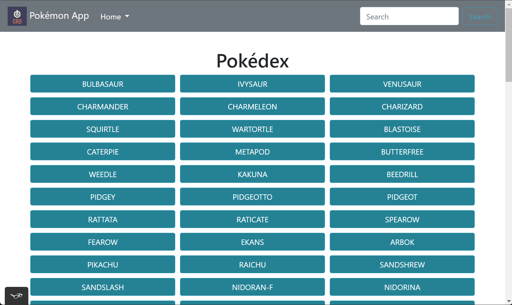

## Table of Contents

- [Overview](#overview)
- [Live Demo](#live-demo)
- [Project Dependencies](#project-dependencies)
- [API Used](#api-used)

## Overview

- The app displays pokemon details in a modal when the user clicks on each pokemon button.
- The app uses JavaScript to fetch data from and external API. Bootstrap was used to create the navbar and modals.
- Responsive design and Accessibility were implemented for seamless navigation across mobile and desktop devices.

## Live Demo

[Click here for the Live Site](https://mittal-malankiya-pokedex.netlify.app)

## Project Dependencies

- HTML
- CSS
- JavaScript
- Bootstrap 4.3.1
- jQuery 3.3.1
- Popper 1.14.7
- Promise-Polyfill
- Fetch

## API Used

- [PokeAPI v2 - Limit 150](https://pokeapi.co/api/v2/pokemon/?limit=150)